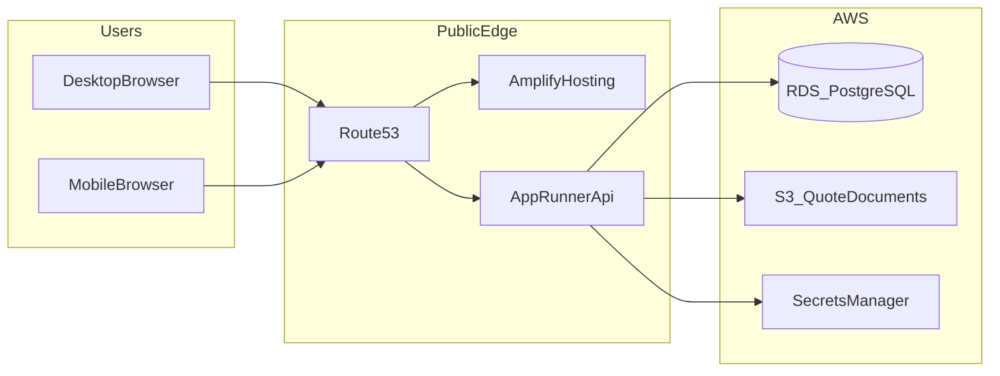

# Yash Honda — Web Quote Generation System  
## Backend Technical Specification (Draft)

**Document owner:** Backend engineering  
**Reviewers:** Frontend engineering, stakeholders  
**Status:** Draft for alignment meeting  
**Scope:** Web application only (desktop and mobile browsers). Native mobile apps are explicitly out of scope for this phase.

---

## 1. Purpose

This document defines how the **backend** of the Yash Honda authorised dealer quotation system will be built, hosted, secured, and integrated with the **web frontend**, so both teams implement the **same business rules, APIs, and data contracts**.

It extends the functional specification with:

- Service boundaries and deployment on **AWS** (customer-provided account).
- **API contracts** (shapes, validation, errors, auth).
- **Data model** and **master-key** pricing rules (product + accessory).
- **Security** and **operational** requirements.
- **Engineering workflow** using **Visual Studio Community** and **GitHub**.

---

## 2. Scope

### 2.1 In scope (this phase)

- Public/dealership web UI hosted on **AWS Amplify Hosting** and served over **HTTPS**; **Amazon Route 53** manages DNS for the website and API domain, and the frontend calls the backend API from the browser over HTTPS.
- **Quote generation** from validated inputs, using **fixed motorcycle base prices** and **master-key–driven** finance and accessory logic.
- **Interchangeable parts/options** in quotes (customer/salesman selections that map to master keys and additive pricing rules).
- **Persistent storage** of masters, quotes, and audit-friendly history as required by the functional spec.
- **Printable / PDF-capable** quotation output; the backend generates the document and stores it in a private **Amazon S3** bucket, returning a time-limited download URL.
- **Multi-user** concurrent access with consistent pricing and conflict handling for shared records (see §8).
- **Dashboard / reporting** data exposed via APIs (aggregation queries, cached where needed).

### 2.2 Out of scope (this phase)

- Native iOS/Android applications.
- Full CRM replacement, DMS integration, or OEM Honda national systems integration (unless later added by change request).
- Exact choice of frontend framework (backend publishes versioned HTTP APIs independent of UI framework).

---

## 3. Stakeholders & roles

| Role | Responsibility |
|------|----------------|
| Customer (self-service web) | Select options, request quote, view/print output where permitted. |
| Sales staff | Enter customer details, generate quotes, follow up. |
| Manager / admin | Masters, pricing keys, user access, reporting. |
| Backend team | APIs, quotation engine, database, security, AWS runtime. |
| Frontend team | Web UI, form validation UX, calling APIs, displaying PDF/print flows. |

**RBAC (minimum):** roles such as `customer`, `sales`, `manager`, `admin` (exact names to align with frontend). All privileged operations require authenticated sessions.

### 3.1 Stakeholder quality benchmark (reference product)

The customer cited **[DINGG](https://dingg.app/home)** (salon/spa/beauty clinic SaaS) as an example of a web product that feels stable and dependable in day-to-day use. That is a **quality bar**, not a requirement to reuse their technology stack or features.

**What we take from this (for backend + joint frontend review):**

- **Reliability is an outcome of engineering practice**, not a single framework: health checks, autoscaling, connection limits, timeouts, retries with backoff, circuit breakers where calling third parties, and database tuning.
- **Users should rarely see raw failures:** structured API errors (§10.4), frontend error boundaries, and friendly fallback UI for outages (frontend-owned patterns, API-supported error codes).
- **Observability:** logs, metrics, and alerts (e.g. AWS CloudWatch) so issues are found and fixed before customers perceive “the site always crashes.”
- **Release discipline:** staging environment, automated tests in CI on GitHub, and gradual or low-risk deploys reduce production defects.

The team may **briefly review** DINGG’s public site for UX polish only. **Do not mirror their stack or vendors by default.** Stakeholder input is guidance on *how the product should feel* (smooth, trustworthy), not a requirement to reuse their APIs, security products, or cloud layout. Backend and DevOps choose **the simplest secure design** that meets this spec and the customer’s AWS environment; adopt a DINGG-equivalent pattern only when it is clearly the best fit.

---

## 4. System context



**Narrative (aligned with architecture diagrams):**

1. Users access the public site through **Amazon Route 53**, which resolves the website domain to **AWS Amplify Hosting** for the frontend and `api.yashhonda.com` to the backend API.
2. The frontend is served over **HTTPS** by Amplify; browser API requests go over **HTTPS** to the backend service running on **AWS App Runner**.
3. The **FastAPI** backend runs on **AWS App Runner** as the web API runtime; it performs deterministic pricing, validation, and quote persistence without requiring the larger ECS/ALB/VPC stack.
4. The backend stores transactional data in **Amazon RDS for PostgreSQL** and reads runtime secrets such as database credentials from **AWS Secrets Manager**.
5. **PDF / print artifacts** are generated by the backend, stored in a private **Amazon S3** bucket, and exposed through time-limited presigned download URLs.

---

## 5. Key business rules: masters, keys, and fixed pricing

### 5.1 Product master keys

**Definition:** Authoritative records for **motorcycle models** the dealership sells, including:

- Fixed **ex-showroom / base vehicle price** (dealership-controlled; not user-editable in quote flow).
- Allowed **variants** (if applicable): model lines, engine options, etc., each with their own base price row if pricing differs.
- Allowed **colours** and any colour-linked price deltas (if any; otherwise colour is non-price).
- Relationships to **finance** and **exchange** rules via foreign keys or key codes.

**Rule:** Base motorcycle price always comes from **product master** rows effective on **quote date** (see §5.4 versioning).

### 5.2 Accessory master keys

**Definition:** Authoritative records for **interchangeable parts and add-ons** (helmets, extended warranty, accessories, packages, etc.) that:

- Have a **stable master key** (string or integer ID) used in APIs and stored on quote line items.
- Have **pricing** (fixed amount, or percentage of base, or rule-driven — to be encoded in master schema).
- Have **compatibility rules** (which models/variants they apply to).

**Rule:** Any selectable “interchangeable” UI option maps to **one or more accessory master keys**; the engine never invents prices outside masters.

### 5.3 Interchangeable parts in quotes

**Definition:** User/salesman choices that are **mutually exclusive** or **combinable** per business rules, e.g.:

- Package A vs Package B (exclusive).
- Add-on X allowed with either package (combinable).

**Backend responsibility:**

- Validate combinations server-side (UI validation is not sufficient).
- Produce a **line-item list** on the quote: each line references `master_key_type` (`product` | `accessory`), `master_key_id`, quantity, unit price snapshot, line total.
- Reject invalid combinations with a structured error code (see §10.4).

### 5.4 Effective dating and versioning

Masters change over time. Every pricing-sensitive master row MUST support:

- `effective_from` (required), `effective_to` (nullable = open-ended).
- Optional `version` or `revision_id` for audit.

**Quote immutability:** Once a quote is issued (status `issued` / `final`), stored amounts are **snapshots**; later master changes do not alter historical quotes.

### 5.5 Finance logic

Finance terms (EMI, interest, tenure, lender-specific rules) are driven by:

- **Product master** linkage to finance plans (which plans apply to which model/variant).
- **Accessory master** rules if certain fees/insurance bundles apply.

Exact formulas belong in a **single module** in the Python engine (documented in code + this spec’s appendix table once finance team confirms).

---

## 6. Functional mapping (FSD → backend)

| FSD area | Backend deliverable |
|----------|---------------------|
| Input module (fields, dropdowns, validation) | `GET` masters for dropdowns; `POST` validate quote draft. |
| Quote generation logic | `POST` generate quote; engine reads masters; returns breakdown + totals. |
| Output module (print/PDF) | `GET` quote PDF or `POST` render job + poll (if async). |
| Dashboard (real-time) | `GET` aggregates + optional WebSocket/SSE channel (TBD with frontend). |
| Database | Relational schema + migrations; indexes for reporting. |
| Multi-user | Row-level locking or optimistic concurrency on editable entities. |
| Security | AuthN/AuthZ, TLS, input validation, audit logs. |

**Performance target (from FSD):** end-to-end quote generation perceived by user **≤ 30 seconds**; backend compute for a standard quote should aim for **sub-second** server time barring PDF generation, which may be asynchronous if needed.

---

## 7. Backend service boundaries

Recommended decomposition (can be one deployable with internal modules initially):

1. **HTTP API layer** — routing, auth, request validation, OpenAPI schema.
2. **Quotation engine (Python)** — pure functions: inputs + master data → priced breakdown; unit-test heavy.
3. **Persistence layer** — repositories/ORM queries; transaction boundaries.
4. **Document service** — PDF creation, upload to a private S3 bucket, presigned URLs.
5. **Reporting service** — read-optimized queries/materialized views (later phase if needed).

---

## 8. Concurrency & data integrity

- **Optimistic locking:** `inquiries` / `quotes` / editable customer records include `version` or `updated_at`; `PATCH` fails with `409 Conflict` if stale.
- **Idempotency:** `POST` operations that create quotes accept optional `Idempotency-Key` header for safe retries.
- **Transactions:** Quote creation + line items + snapshot in one DB transaction.

---

## 9. Data model (initial entity list)

Entities (names indicative; final naming in migration files):

- `users`, `sessions` / refresh tokens (or delegate to IdP).
- `roles`, `user_roles`.
- `customers` (unique phone/email rules per dealership policy).
- `product_masters`, `product_variants`, `colours`, `model_colour_map`.
- `accessory_masters`, `accessory_compatibility`.
- `finance_plans`, `finance_rules` (normalized per final finance design).
- `exchange_rules` or `trade_in_schemes`.
- `quotes`, `quote_line_items`, `quote_snapshots` (JSON blob optional for legal/audit mirror).
- `quote_documents` (storage key, checksum, created_at).
- `audit_logs` (who changed masters, who issued quote).

**Indexing:** foreign keys on all relations; composite indexes for dashboard date + location filters.

---

## 10. API specification (REST, versioned)

**Base URL:** `https://api.yashhonda.com/v1` (example; final domain with DevOps).  
**Format:** JSON UTF-8. **Errors:** JSON problem-detail style (see §10.4).

### 10.1 Authentication

- **Option A (recommended for web):** JWT access token (short-lived) + refresh token (httpOnly cookie or secure storage strategy agreed with frontend).
- **Option B:** Session cookies with CSRF protection for cookie-based auth.

All mutating endpoints require auth except explicitly public marketing endpoints (if any).

### 10.2 Core endpoints (draft catalogue)

**Masters (read for dropdowns)**

| Method | Path | Description |
|--------|------|-------------|
| GET | `/masters/models` | List active models for quote date. |
| GET | `/masters/models/{id}/variants` | Variants + base prices effective. |
| GET | `/masters/models/{id}/colours` | Colours. |
| GET | `/masters/accessories` | Accessories with compatibility filters via query params. |
| GET | `/masters/finance-plans` | Plans filtered by model/variant. |
| GET | `/masters/exchange-options` | Exchange schemes. |

**Customers & quotes**

| Method | Path | Description |
|--------|------|-------------|
| POST | `/customers` | Create customer (sales). |
| GET | `/customers` | Search (phone/email) — auth + rate limited. |
| POST | `/quotes/preview` | Validate + price without persisting (optional). |
| POST | `/quotes` | Create persisted quote (snapshot). |
| GET | `/quotes/{id}` | Quote detail + line items. |
| GET | `/quotes/{id}/pdf` | PDF download (redirect or stream). |
| GET | `/quotes` | List with filters (role-restricted). |

**Admin (masters write)**

| Method | Path | Description |
|--------|------|-------------|
| POST/PATCH | `/admin/product-masters/...` | CRUD with effective dating. |
| POST/PATCH | `/admin/accessory-masters/...` | CRUD + compatibility. |
| POST/PATCH | `/admin/finance-rules/...` | CRUD. |

**Dashboard / reporting**

| Method | Path | Description |
|--------|------|-------------|
| GET | `/reports/daily-summary` | Counts, funnel metrics. |
| GET | `/reports/quotes` | Filtered list export. |

*Exact paths can be adjusted for REST consistency; this catalogue is the alignment baseline for the frontend meeting.*

### 10.3 Example request/response (quote create)

`POST /v1/quotes`

Request (illustrative):

```json
{
  "customer_id": "uuid",
  "source": "walk_in",
  "area": "string",
  "model_id": "uuid",
  "variant_id": "uuid",
  "colour_id": "uuid",
  "purchase_mode": "finance",
  "finance_plan_id": "uuid",
  "exchange": { "scheme_id": "uuid", "declared_value": 15000 },
  "accessory_keys": ["ACC_HELMET_01", "ACC_WARRANTY_EXT"],
  "sales_executive_id": "uuid",
  "remarks": "string"
}
```

Response (illustrative):

```json
{
  "quote_id": "uuid",
  "quote_number": "YH-2026-000123",
  "status": "issued",
  "totals": {
    "base_ex_showroom": 125000,
    "accessories": 8500,
    "exchange_adjustment": -15000,
    "on_road_estimate": 142000,
    "currency": "INR"
  },
  "line_items": [
    { "type": "product", "master_key": "MODEL_XYZ_V1", "description": "...", "unit_price": 125000, "qty": 1, "line_total": 125000 },
    { "type": "accessory", "master_key": "ACC_HELMET_01", "description": "...", "unit_price": 3500, "qty": 1, "line_total": 3500 }
  ],
  "pdf": { "url": "https://...", "expires_at": "ISO8601" }
}
```

### 10.4 Standard errors

| HTTP | Code | Meaning |
|------|------|---------|
| 400 | `VALIDATION_ERROR` | Missing/invalid fields. |
| 401 | `UNAUTHORIZED` | No/invalid token. |
| 403 | `FORBIDDEN` | Role insufficient. |
| 404 | `NOT_FOUND` | Unknown id. |
| 409 | `CONFLICT` | Stale version or invalid combination. |
| 422 | `BUSINESS_RULE_VIOLATION` | Valid JSON but masters/rules reject (e.g. incompatible accessory). |
| 429 | `RATE_LIMITED` | Throttled. |
| 500 | `INTERNAL_ERROR` | Unexpected (no sensitive details). |

---

## 11. Security architecture

### 11.1 Transport & edge

- TLS 1.2+ everywhere; HSTS on public endpoints.
- Public endpoints are limited to the frontend site on Amplify and the backend API on App Runner; this specification lists only services required to deploy the current web application.
- Separate **dev / staging / prod** environments; prod data never used in lower envs.

### 11.2 Application security

- Strong password policy if password auth; prefer **MFA for admin**.
- Input validation on every write; parameterized queries only (ORM or prepared statements).
- Output encoding concerns primarily on frontend; backend returns structured data.
- CORS restricted to known web origins.
- Rate limiting on auth and search endpoints (phone lookup).

### 11.3 Data protection

- Encrypt RDS at rest; encrypt S3 buckets; deny public ACLs.
- Store secrets such as database credentials, signing keys, and API credentials in **AWS Secrets Manager** (not in GitHub).
- Keep the deployment footprint limited to the mandatory services for this web-only phase; earlier optional infrastructure such as **ECS**, **ALB**, **WAF**, **NAT Gateway**, and dedicated CI/CD infrastructure is intentionally not part of the required deployment list.
- PII minimization: only store fields required by dealership compliance.

### 11.4 Audit

- Log quote issuance, master changes, admin actions with user id and timestamp.

---

## 12. AWS deployment (mandatory-only web deployment)

This section lists only the AWS services required to deploy the current web-only application. Earlier optional infrastructure from previous drafts, such as **Amazon ECS**, **Application Load Balancer**, **Amazon VPC / NAT Gateway**, **AWS WAF**, and CI/CD-specific AWS wiring, is intentionally excluded from the mandatory deployment list.

| Concern | AWS service | Implementation in this build |
|---------|-------------|-------------------------------|
| Frontend hosting | AWS Amplify Hosting | Hosts the public web app and serves the website over HTTPS. |
| DNS | Amazon Route 53 | Manages the main website domain and `api` subdomain routing. |
| Backend runtime | AWS App Runner | Hosts the FastAPI backend directly as the web API runtime. |
| Database | Amazon RDS for PostgreSQL | Stores masters, customers, quotes, line items, snapshots, and audit-friendly transactional data. |
| Object storage | Amazon S3 | Stores generated quote PDFs and related document artifacts in a private bucket. |
| Secrets | AWS Secrets Manager | Injects runtime secrets such as database credentials and signing keys into the backend. |

### 12.1 Implementation notes

- **Frontend:** Amplify hosts the web application and serves the public dealership/customer experience.
- **DNS:** Route 53 resolves the main website domain to Amplify and the API subdomain to the App Runner backend service.
- **Backend runtime:** The FastAPI application is deployed to App Runner as the web API runtime for the current phase.
- **Persistence:** RDS PostgreSQL is the system of record for masters, customers, inquiries, quotes, quote line items, and audit data.
- **Documents:** Generated PDFs are uploaded to a private S3 bucket and returned to the caller through presigned URLs.
- **Secrets:** Secrets Manager stores database credentials and other runtime-sensitive values required by the backend.

### 12.2 Ongoing cost guidance

For a dev-sized MVP using only the mandatory services above, expect an ongoing monthly spend of roughly **$30-$100/month** before taxes.

| Service | Practical monthly estimate | Notes |
|---------|----------------------------|-------|
| AWS Amplify Hosting | `$0-$10` | Low traffic and modest build activity usually keep this small. |
| Amazon Route 53 | `$0.50-$2` | Hosted zone charges are low; query cost is usually minor at MVP scale. |
| AWS App Runner | `$5-$30` | Depends on whether the service runs continuously and how much active compute it uses. |
| Amazon RDS for PostgreSQL | `$20-$50` | Usually the largest steady cost item for a small single-AZ database. |
| Amazon S3 | `$1-$5` | Usually low for PDF storage unless document volume grows significantly. |
| AWS Secrets Manager | `$1-$3` | Based on the number of stored secrets and a small number of API calls. |

**Main cost drivers:** For this reduced architecture, the ongoing cost is driven primarily by **Amazon RDS for PostgreSQL** and **AWS App Runner**. Amplify, Route 53, S3, and Secrets Manager are usually much smaller line items for a dev-sized deployment.

### 12.3 App Runner assumption

This architecture assumes the project can use **AWS App Runner** as an existing or otherwise eligible customer before AWS's stated cutoff for new App Runner customers.

### 12.4 Environments

- `dev`: isolated MVP environment with the smallest practical deployment footprint for feature testing and internal validation.
- `staging`: optional later environment if release verification requires a separate pre-production deployment.
- `prod`: isolated live environment using the same mandatory service pattern when the project moves beyond the current phase.

---

## 13. Non-functional requirements

| Area | Requirement |
|------|-------------|
| Performance | Quote API median < 1s (excluding PDF); PDF async if > 3s. |
| Availability | Target uptime agreed with stakeholder (e.g. 99.5% MVP). |
| Scalability | Horizontal scaling of stateless API tier; connection pooling to RDS. |
| Reliability | Automated RDS backups; S3 versioning optional for PDFs. |
| Perceived stability | Align with stakeholder expectation (reference: [DINGG](https://dingg.app/home)): avoid unhandled 5xx in normal load; graceful degradation and clear messages when a dependency fails. |
| Operability | Dashboards/alarms for error rate, latency, and dependency health; runbooks for common incidents. |
| Usability (backend-driven) | Dropdown-first APIs; minimal free-text in pricing paths. |

**Note:** No product achieves literally zero errors; the goal is **low defect rate**, **fast detection**, and **fast recovery**, plus **honest** status communication if something breaks.

---

## 14. Engineering workflow (Visual Studio Community + GitHub)

### 14.1 Repository layout (suggested)

- `backend/` — Python API + quotation engine + tests.
- `frontend/` — web app (owned by frontend team) *or* separate repo if preferred.
- `infra/` — IaC (Terraform/CDK) optional.
- `docs/` — this specification + OpenAPI YAML.

### 14.2 Branching

- `main` — production releases (protected).
- `develop` — integration (optional).
- Feature branches `feature/<ticket>-short-name`; PR required; CI must pass.

### 14.3 Visual Studio Community

- Use VS for Python development (or VS + preferred Python tooling); keep **virtual environment** committed via `requirements.txt` / `pyproject.toml` only, not the venv folder.
- **Launch profiles** for local API against local Docker DB (optional).

### 14.4 GitHub hygiene

- `.env.example` with dummy keys; real secrets never committed.
- Dependabot / security alerts enabled.
- Tags `v1.0.0` for releases; changelog maintained.

---

## 15. Frontend–backend alignment checklist (for your review meeting)

- [ ] Agree **OpenAPI 3** as source of truth; publish generated types for frontend if used.
- [ ] Confirm **auth mechanism** (JWT vs cookie) and CORS origins.
- [ ] Lock **dropdown field list** vs FSD (names, required vs optional).
- [ ] Define **multi-select** rules (max 3 where applicable) per field in API schema.
- [ ] Confirm **quote states** and when PDF is available.
- [ ] Agree **error shape** and user-facing message mapping on UI.
- [ ] Define **real-time** approach for dashboard (poll vs WebSocket vs SSE).
- [ ] Confirm **date/timezone** handling (IST for business dates).
- [ ] Agree **user-visible error handling** (loading states, retry, support contact) and map API error codes to copy; align with stakeholder “stable product” expectations without promising impossible uptime.

---

## 16. Implementation phases (suggested)

1. **Phase 1 — MVP:** Masters read APIs, quote create/read, PDF basic, auth baseline, RDS prod-like in staging.
2. **Phase 2:** Admin master CRUD, audit logs, reporting endpoints, rate limits, hardening.
3. **Phase 3:** Scale-out, read replicas, caching, advanced reporting.

---

## 17. Open items (to resolve in meeting)

- Exact **finance formulas** and rounding rules (per rupee, GST handling if applicable).
- Whether **customers** self-register or only sales creates records.
- PDF branding assets storage and **cache invalidation** rules.
- Final **Python framework** (FastAPI vs Django REST) — pick one and lock in OpenAPI generation.

---

## Appendix A — Glossary

- **Master key:** Stable identifier for a product or accessory row used in rules and APIs.
- **Snapshot:** Frozen copy of prices and descriptions at quote issuance time.
- **Interchangeable part:** User-selectable option mapped to accessory masters with compatibility constraints.

---

*End of draft — revise OpenAPI paths and entity names after frontend/backend joint review.*
